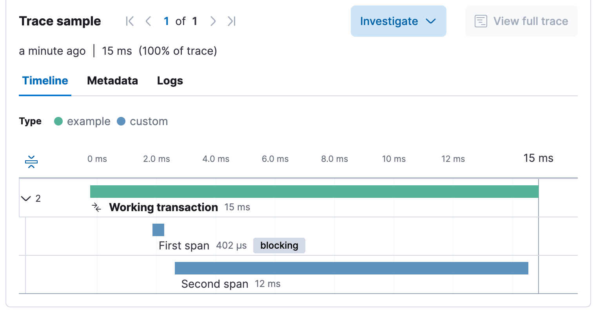
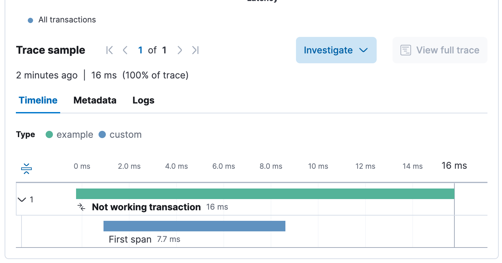

# elastic-apm-exit-span-issue

Minimum example to reproduce issue with Elastic APM Node.js Agent, where exit spans created inside async functions are blocking subsequent span creations.

Used versions

- Elasticsearch: 8.17.4
- APM Server: 8.17.4
- Kibana: 8.17.4
- elastic-apm-node: 4.11.2
- Node.js: 22.14.0

## Usage

1. Start elasticsearch, apm-server and kibana using docker compose.

   ```bash
   docker compose up
   ```

2. Install dependencies.

   ```bash
   npm install
   ```

3. Once the elasticsearch is running, send APM events from Node.js.

   ```bash
   node working.js
   node not-working.js
   ```

4. View transactions in [Kibana](http://localhost:5601/app/apm/services/example/transactions?environment=ENVIRONMENT_ALL&kuery=&rangeFrom=now-1h&rangeTo=now).

5. Transaction created in `working.js` works as expected and contains two spans. Transaction created in `not-working.js` is missing the second span.

   
   
